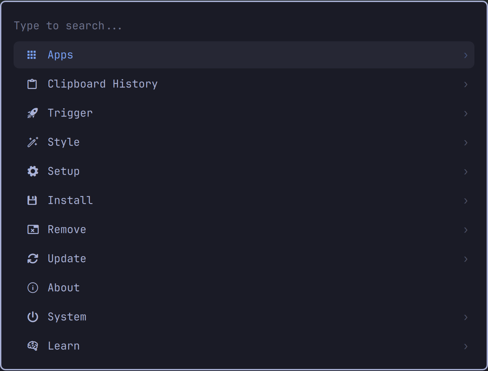

# Unified Launcher for Omarchy

A fast, preloaded command palette for Omarchy Quattro. Unified Launcher brings
apps, Omarchy actions, live Hyprland keybindings, clipboard history, emoji, and
reminders into one searchable menu while leaving specialized fullscreen
surfaces—such as Omarchy's image picker—as standalone overlays.



## Features

- Search and launch desktop applications and Omarchy actions.
- Browse and execute live Hyprland keybindings with their shortcuts visible.
- Native clipboard history with text, file, and image previews.
- Native emoji grid backed by Omarchy's emoji catalog and insertion helper.
- Set and manage Omarchy reminders without replacing their systemd backend.
- Keyboard, mouse, arrow, Page Up/Down, Home/End, and `Ctrl+J/K` navigation.
- Preserved submenu search, selection, and scroll state.
- Preloaded inside the existing `omarchy-shell` process.

Clipboard contents, clipboard images, and reminder runtime state remain under
Omarchy's normal runtime directories. Unified Launcher does not copy them into
the plugin directory.

## Requirements

- Omarchy Quattro with the current Quickshell plugin system.
- The standard Omarchy clipboard, emoji, reminder, menu, and Hyprland tools.

No extra daemon is installed and the plugin never starts a second Quickshell
process.

## Install

Review the repository first: Omarchy plugins execute unsandboxed with your user
permissions. Then install and enable it:

```bash
omarchy plugin add https://github.com/alivault/omarchy-unified-launcher.git --enable
```

Unified Launcher intentionally declares that it replaces `omarchy.menu` while
enabled. This preserves existing `omarchy-menu` commands and Omarchy's menu
shortcuts. Removing the plugin restores the built-in menu.

### Recommended shortcut

Add this user-owned override to `~/.config/hypr/bindings.lua`:

```lua
hl.unbind("SUPER + SPACE")
o.bind(
  "SUPER + SPACE",
  "Unified Launcher",
  hl.dsp.global("io.github.alivault.omarchy-unified-launcher:toggle")
)
```

Reload and check Hyprland after editing:

```bash
hyprctl reload
hyprctl configerrors
```

The plugin also supplies a bar widget. Omarchy places it in the left section by
default when there is no built-in menu widget to replace.

## Usage

Open the root or a native subview through Omarchy's normal menu interface:

```bash
omarchy menu toggle root
omarchy menu summon clipboard
omarchy menu summon emoji
omarchy menu summon reminder-set
omarchy menu summon reminders
```

Useful keys:

| Key | Action |
| --- | --- |
| `Enter` / `Right` | Open or execute |
| `Left` / `Backspace` | Return to the previous view |
| Arrow keys | Navigate |
| `Ctrl+J` / `Ctrl+K` | Next / previous |
| `Page Up` / `Page Down` | Move by page |
| `Home` / `End` | First / last |
| `Delete` | Delete the selected clipboard entry or reminder |
| `Shift+Delete` | Clear clipboard history or all reminders, with confirmation |
| `Escape` | Clear search, go back, or close |

The fullscreen Theme and Background image pickers remain their own Omarchy
overlays by design.

## User menu overrides

Unified Launcher layers its additions between Omarchy's default menu and your
existing user extension:

```text
Omarchy defaults → plugin menu.jsonc → ~/.config/omarchy/extensions/omarchy-menu.jsonc
```

Reuse an item ID in your extension to change its label, icon, action, provider,
position, or aliases.

## Update and remove

```bash
omarchy plugin update io.github.alivault.omarchy-unified-launcher
omarchy plugin remove io.github.alivault.omarchy-unified-launcher
```

## Development

```bash
omarchy plugin validate .
qmllint -I "$OMARCHY_PATH/shell" \
  Menu.qml BarWidget.qml ClipboardSubview.qml EmojiSubview.qml ReminderSubview.qml
```

When testing a changed checkout, restart the shell if QML's component cache
does not pick up a hot reload:

```bash
omarchy restart shell
```

## License

MIT. See [`LICENSE`](LICENSE) and [`NOTICE`](NOTICE). Unified Launcher is based
on Omarchy's MIT-licensed first-party menu and helper modules.
